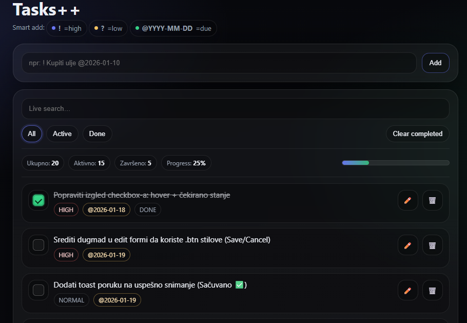
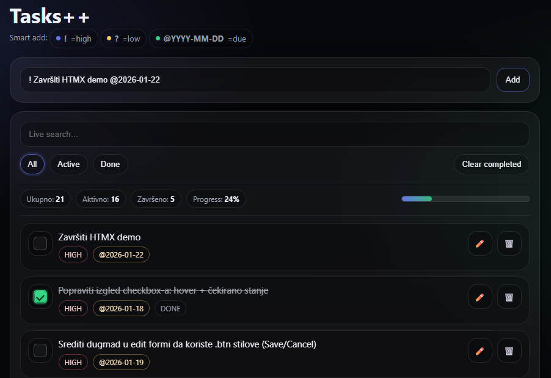
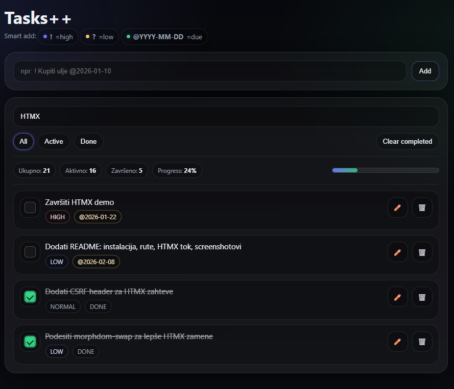
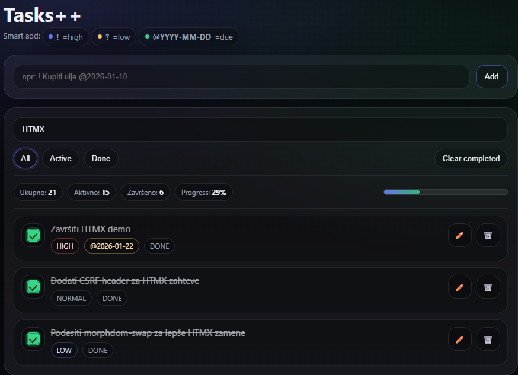
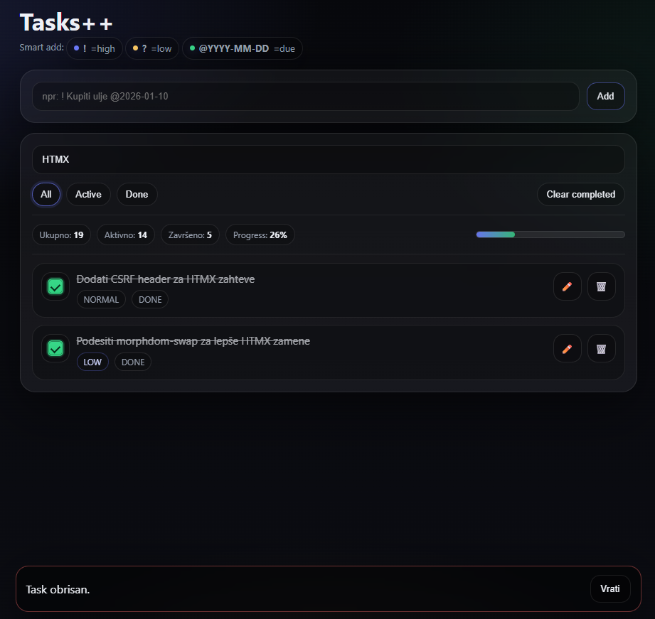

# Tasks++
### Server-driven interaktivna web aplikacija (Laravel + HTMX)

**Tasks++** je jednostavna, ali moderna To-Do web aplikacija koja demonstrira kako je moguće izgraditi interaktivan korisnički interfejs bez korišćenja SPA framework-a (React, Vue, Angular), primenom **HTMX-a** i klasičnog server-side pristupa.

Projekat je razvijen kao edukativni tutorijal sa ciljem da pokaže alternativni pristup izradi CRUD i administrativnih aplikacija, gde SPA arhitektura često uvodi nepotrebnu kompleksnost.

---

## 🎯 Problem koji se rešava

U savremenom razvoju web aplikacija SPA framework-i se vrlo često koriste i u situacijama kada za to realno nema potrebe.

Kod velikog broja realnih aplikacija (CRUD sistemi, admin paneli, forme, dashboard-i):

- potrebne su parcijalne izmene korisničkog interfejsa
- nema kompleksnog client-side state-a
- interakcije su jednostavne i predvidive

U tim slučajevima SPA pristup često dovodi do:

- povećane kompleksnosti projekta
- dodatnog build procesa
- potrebe za state management-om
- uvođenja API sloja (JSON)
- dupliranja logike između frontenda i backenda

Cilj ovog projekta je da pokaže kako se **interaktivnost može postići direktno kroz HTML**, uz minimalan JavaScript i potpunu kontrolu na serverskoj strani.

---

## 💡 Izabrano rešenje – HTMX

**HTMX** je frontend biblioteka koja omogućava slanje HTTP zahteva direktno iz HTML-a pomoću `hx-*` atributa, uz parcijalno ažuriranje delova stranice bez potpunog reload-a.

U kombinaciji sa **Laravel-om i Blade template-ima**, dobija se:

- jednostavan i čitljiv kod
- brz razvoj aplikacije
- lako održavanje
- server-driven UI
- koncept *HTML over the wire* (server vraća HTML, ne JSON) 

Logika ostaje na serveru, dok klijent dobija samo HTML fragmente koji se direktno ubacuju u DOM.
Ovaj pristup se često naziva **server-driven UI**, jer server ima glavnu ulogu u generisanju korisničkog interfejsa, dok klijent služi prvenstveno za prikaz i slanje korisničkih interakcija.

---

## 🧰 Korišćene tehnologije

- **Laravel (PHP)** – backend logika, routing, validacija
- **Blade** – server-side rendering i partial views
- **HTMX** – interaktivnost bez SPA framework-a
- **MySQL** – baza podataka
- **HTML / CSS** – korisnički interfejs

---

## ✨ Funkcionalnosti aplikacije

- Dodavanje taskova bez reload-a stranice
- “Smart add” sintaksa:
    - `!` → high priority
    - `?` → low priority
    - `@YYYY-MM-DD` → rok izvršenja
- Live search (pretraga dok korisnik kuca)
- Filteri: All / Active / Done
- Obeležavanje taska kao završenog (toggle)
- Inline izmena taska
- Brisanje taska uz mogućnost vraćanja (Undo)
- Automatsko ažuriranje statistike i progresa
- Parcijalno osvežavanje UI-ja (bez full page reload-a)

---

## ⚙️ Tehničke karakteristike (HTMX u praksi)

U projektu su korišćeni sledeći ključni HTMX koncepti, koji omogućavaju izradu interaktivnog korisničkog interfejsa bez SPA framework-a:

🔹 HTTP zahtevi iz HTML-a
   - **hx-get**, **hx-post**, **hx-patch**, **hx-delete**
   - Omogućavaju slanje standardnih HTTP zahteva direktno iz HTML elemenata, bez pisanja JavaScript koda.
   - Na ovaj način se zadržava REST pristup (GET, POST, PATCH, DELETE), dok se interakcije obavljaju asinhrono.

🔹 Ciljanje delova stranice
   - **hx-target** 
   - Definiše tačno koji deo DOM-a treba da se ažurira nakon što server vrati odgovor.
   - Umesto osvežavanja cele stranice, menja se samo relevantni deo korisničkog interfejsa.

🔹 Način ubacivanja odgovora
   - **hx-swap**
   - Određuje kako se HTML odgovor sa servera ubacuje u postojeći DOM
   - (zamena sadržaja, dodavanje na početak/kraj, uklanjanje elemenata i sl.).

🔹 Kontrola trenutka slanja zahteva
   - **hx-trigger**
   - Omogućava preciznu kontrolu nad tim kada se HTTP zahtev šalje
   - (klik, submit forme, promene input polja, debounce kod live search-a).

🔹 Grananje logike na serverskoj strani
   - **HX-Request**
   - Omogućava backend-u da razlikuje klasične HTTP zahteve od HTMX zahteva.
   - Na osnovu toga, kontroler može da vrati ili celu stranicu ili samo HTML fragment.

🔹 Blade partial views
   - **HTML partial views (Blade)**
   - Koriste se za razlaganje korisničkog interfejsa na manje, ponovo iskoristive komponente
   - (pojedinačni task, lista taskova, statistika).
   - Ovim pristupom se UI i logika u potpunosti kontrolišu na serveru.

🔹 Out-of-Band update (OOB)
   - **Out-of-Band swap (_oob)**
   - Omogućava ažuriranje delova stranice koji nisu direktno ciljani hx-target atributom.
   - U projektu se koristi za ažuriranje statistike, poruka i drugih globalnih UI elemenata
   - bez dodatnih zahteva ili reload-a stranice.

Server uvek vraća **HTML fragment**, koji HTMX direktno ubacuje u postojeću stranicu, čime se postiže interaktivnost bez SPA složenosti i bez potrebe za JSON API slojem.

---

## 🧠 Arhitektonski pristup

Aplikacija koristi klasične HTTP metode (GET, POST, PATCH, DELETE), dok se interaktivnost postiže vraćanjem HTML fragmenata umesto JSON odgovora.  
Na taj način se zadržava REST filozofija, uz modernu interaktivnost bez SPA složenosti.

---

## 📁 Struktura projekta (pregled)

Projekat je organizovan kao klasična Laravel aplikacija, uz jasnu podelu odgovornosti:

- `routes/web.php` – definicija ruta za HTMX zahteve
- `app/Http/Controllers/TaskController.php` – obrada zahteva i generisanje HTML odgovora
- `resources/views/tasks/` – Blade view-ovi i HTML partiali
    - `_item.blade.php` – prikaz jednog taska
    - `_region.blade.php` – lista taskova + statistika
    - `_oob.blade.php` – out-of-band update (statistika, poruke)
- `app/Models/Task.php` – Eloquent model
- `database/migrations/` – struktura baze podataka

Ovakva struktura omogućava jasan **server-driven UI** pristup, gde se kompletna logika i prikaz kontrolišu na serverskoj strani.
Frontend ne poseduje sopstveni state niti kompleksnu poslovnu logiku, već se u potpunosti oslanja na HTML koji generiše backend.

---

## ⚖️ Poređenje sa alternativama

| Rešenje | Prednosti | Nedostaci |
|------|----------|----------|
| React / Vue | Moćni SPA framework-i | Overkill za jednostavne CRUD aplikacije |
| Livewire | Laravel-native rešenje | Više “magije”, jača vezanost za framework |
| Alpine.js | Lagan JavaScript | I dalje zahteva JS logiku |
| **HTMX** | Minimalizam, čitljiv HTML | Manje pogodan za kompleksan client-state |

HTMX je izabran jer najbolje odgovara **jednostavnim, ali interaktivnim aplikacijama**.

---

## 🚀 Pokretanje projekta (lokalno)

U nastavku su navedeni koraci potrebni za lokalno pokretanje aplikacije i reprodukciju demonstriranih funkcionalnosti.

### Preduslovi

Za pokretanje projekta potrebno je imati instalirano:
- PHP 8+
- Composer
- MySQL

### Instalacija

1. Kloniranje repozitorijuma i instalacija PHP zavisnosti:

```bash
git clone https://github.com/jana17547/tasks-htmx.git
cd tasks-htmx
composer install
```

2. Podešavanje okruženja:

- Kopirati **.env.example** u **.env**
- Podesiti konekciju ka MySQL bazi

```bash
php artisan key:generate
```

3. Pokretanje migracija baze:

```bash
php artisan migrate
```

4. Pokretanje servera:

```bash
php artisan serve
```

### Aplikacija je dostupna na:

👉 http://127.0.0.1:8000

---

## 📽️ Demo

U okviru projekta je pripremljen i demo snimak aplikacije, koji prikazuje:

### Početni prikaz aplikacije


### Dodavanje taska bez reload-a

- Task se dodaje pomoću `hx-post` zahteva, a server vraća HTML fragment koji se bez reload-a ubacuje u listu.


### Live search

- Pretraga taskova se izvršava u realnom vremenu pomoću `hx-get` zahteva.
- Dok korisnik kuca, server vraća filtriranu HTML listu taskova, bez osvežavanja cele stranice.

### Promena statusa taska

- Klikom na checkbox šalje se zahtev (PATCH) ka serveru, a server vraća ažurirani HTML fragment samo za taj task.
- Status i statistika se ažuriraju bez osvežavanja cele stranice.

### Automatsko ažuriranje statistike (OOB)

- Prilikom brisanja taska, server vraća više HTML fragmenata.
- Pored uklanjanja taska iz liste, automatski se ažurira statistika i prikazuju poruke koristeći HTMX out-of-band swap (_oob), bez osvežavanja cele stranice.

---

## 🧠 Zaključak

HTMX nije zamena za SPA framework-e, ali predstavlja **racionalnu i efikasnu alternativu** za CRUD i administrativne aplikacije gde je potrebna interaktivnost bez dodatne kompleksnosti.

Ovim pristupom **HTML i backend ponovo imaju glavnu ulogu**, dok se JavaScript koristi samo tamo gde je zaista neophodan.